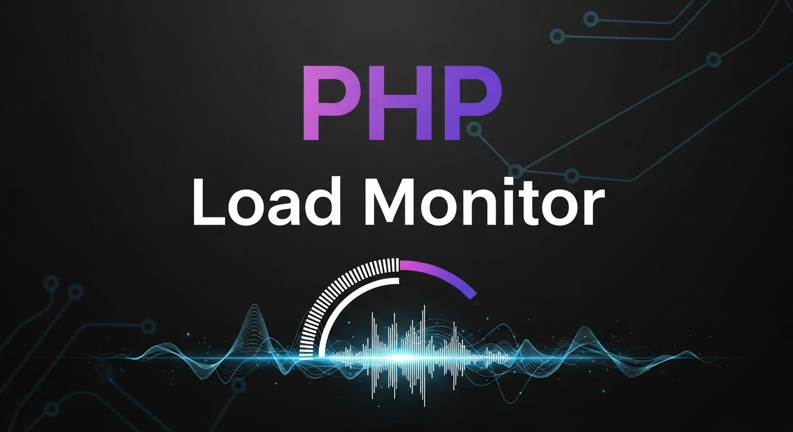

# PHP Load Monitor 📊

Readme: [Português](README.md)




Um script minimalista e eficiente para monitorar a carga do sistema (Load Average) e o uso de memória RAM em tempo real, combinando a agilidade do Shell Script com a facilidade de exibição do PHP.

## 🚀 Como funciona

O projeto consiste em um script principal (`php-load-monitor.sh`) que extrai informações vitais do sistema operacional e as formata para exibição. Ele é ideal para verificações rápidas de performance sem a necessidade de instalar ferramentas complexas de monitoramento ou bancos de dados.

### Informações monitoradas:

* **Load Average:** Médias de carga de 1, 5 e 15 minutos (via `uptime`).
* **Memória RAM:** Uso total, usado e livre (via `free -m`).

## 📋 Pré-requisitos

* Sistema Operacional Linux/Unix.
* PHP instalado (para execução via CLI ou servidor web).
* Permissões de execução no script shell.

## 🔧 Instalação e Uso

1. **Clone o repositório:**
```bash
git clone https://github.com/sr00t3d/php-load-monitor.git
cd php-load-monitor

```

2. **Dê permissão de execução ao script:**
```bash
chmod +x php-load-monitor.sh

```

3. **Execução:**
Você pode rodar o script diretamente via PHP:
```bash
php php-load-monitor.sh

```

## 🛠️ Estrutura do Código

O script utiliza comandos nativos do Linux para obter os dados:

* `uptime`: Para capturar o estado de carga do processador.
* `free -m`: Para detalhar o consumo de memória em Megabytes.
* `awk`: Para filtrar e formatar a saída de texto.

## 📚 Tutorial Detalhado

Para um guia completo passo a passo, confira meu artigo completo:

👉 [**Verificar rapidamente LOAD do PHP.**](https://perciocastelo.com.br/blog/fast-check-load-php.html)

## Licença 📄

Este projeto está licenciado sob a **GNU General Public License v3.0**. Veja o arquivo [LICENSE](LICENSE) para mais detalhes.